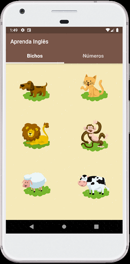

# Aprenda Inglês

App feito em Flutter que reproduz áudios com os nomes em inglês de animais e de números quando clicados em suas respectivas imagens.

#### Técnicas utilizadas

- Extensão [audioplayers](https://pub.dev/packages/audioplayers) para reprodução de áudios.
- TabBar e assets (imagens e vídeos).

#### Screenshots

